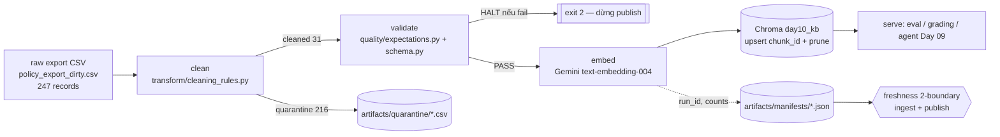

# Kiến trúc pipeline — Lab Day 10

**Nhóm:** Team Day10 — Data Platform (CS + IT Helpdesk KB)
**Cập nhật:** 2026-06-10

---

## 1. Sơ đồ luồng

- **Điểm đo freshness:** trên manifest — `latest_exported_at` (ingest snapshot) và `run_timestamp` (publish run).
- **run_id:** sinh ở `cmd_run` (UTC timestamp hoặc `--run-id`), ghi vào log, manifest, và metadata mỗi vector.
- **quarantine:** mọi record bị loại ghi kèm `reason` vào `artifacts/quarantine/quarantine_<run_id>.csv`.

---

## 2. Ranh giới trách nhiệm

| Thành phần | Input | Output | Owner nhóm |
|------------|-------|--------|--------------|
| Ingest | `data/raw/policy_export_dirty.csv` | list[dict] rows, `raw_records` | Ingestion Owner |
| Transform | raw rows | cleaned rows + quarantine rows | Cleaning/Quality Owner |
| Quality | cleaned rows | `ExpectationResult[]` + cờ halt + pydantic validate | Cleaning/Quality Owner |
| Embed | cleaned CSV | Chroma collection `day10_kb` (upsert + prune) | Embed Owner |
| Monitor | manifest JSON | freshness PASS/WARN/FAIL (2 boundary) | Monitoring/Docs Owner |

---

## 3. Idempotency & rerun

- **Upsert theo `chunk_id`** = `sha256(doc_id|chunk_text|seq)[:16]` → chạy lại cùng dữ liệu **không** tạo vector trùng.
- **Prune:** trước khi upsert, xoá mọi id còn trong collection nhưng không còn trong cleaned của run này (`embed_prune_removed` trong log) → index luôn là **snapshot publish**, không còn “mồi cũ” trong top-k.
- **Cache embedding:** `artifacts/cache/embeddings/*.json` theo nội dung → rerun không tốn quota Gemini.
- Rerun 2 lần: `embed_upsert count` giữ nguyên, không phình collection.

---

## 4. Liên hệ Day 09

Pipeline này **làm mới corpus** cho retrieval của multi-agent Day 09 nhưng **tách collection** (`day10_kb` ≠ collection Day 09) để cô lập thử nghiệm data-quality. Cùng `data/docs/` canonical; Day 09 có thể trỏ sang `day10_kb` sau khi pipeline publish PASS để “đọc đúng version” (refund 7 ngày, HR 12 ngày 2026, access_control_sop).

---

## 5. Rủi ro đã biết

- Gemini API rate-limit/quota khi embed lần đầu (đã giảm bằng cache + batch 64 + retry).
- `text-embedding-004` dùng chung cho cả document và query (không tách task_type) — đủ tốt cho keyword-grading, có thể tinh chỉnh sau.
- CSV mẫu có `exported_at` cũ → ingest-boundary freshness FAIL theo thiết kế (xem runbook).
- Allowlist là source-of-truth ở contract; thêm nguồn mới phải sửa `contracts/data_contract.yaml` **và** đồng bộ canonical doc.
